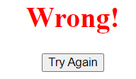
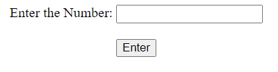
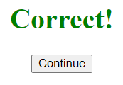
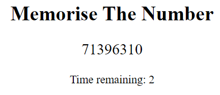
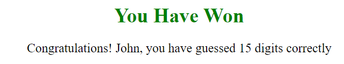
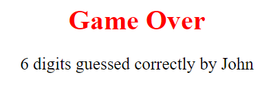

## The Memory Game
https://memorygame-one-kappa.vercel.app/project.html

    - HTML
    - CSS
    - Javascript

## Description of the game

    - This is a game that tests the memory of the player using numbers.

    - A random set of numbers is generated when the user starts the game.

    - The player wins the game when 15 digits are correctly memorised.

    - The set of numbers start small and gradually increase when the player guesses correctly.

    - The player is allowed only 3 failed attempts before it is game over.

## Playing the game
The player is allowed to choose between 3 difficulty levels.

    - Easy: The random number starts with 4 digits, and is incrememted by 1.

    - Medium: The random number starts with 6 digits, and is incrememted by 2.

    - Hard: The random number starts with 8 digits, and is incrememted by 3.

    - The player has to memorise the number before the 5 second timer and enter the number.
    
    - If the player gets the number wrong, there is no increment.
    

The Javascript code snippet of the different difficulty levels

If the number is enter correctly,

The player continues with a longer set of numbers,

If the number is wrong, the player tries again with the same number of digits.

If the player manages to guess 15 digits correctly, they automatically win the game with thier username reflected.

If the player uses up all 3 attempts, the game is over, reflecting the best score of the player.

## Future Enhancements

    - Adding a countdown timer for the player to input the number.
    - Adding additional elements that the players has to memorise along with the numbers eg. Colors, shapes, words.